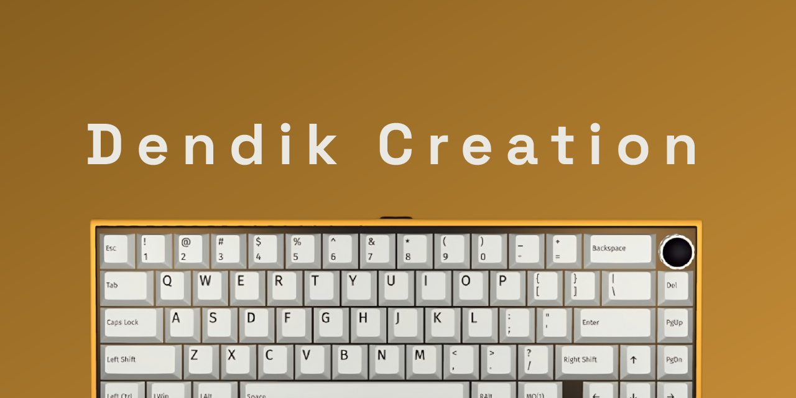

### 🧭 About Me

- 💡 What began as a curiosity has evolved into a lifelong journey in programming.
- 🧠 I enjoy dissecting complex problems and transforming them into elegant solutions.
- 🔁 From HTML tweaks to building scalable fullstack applications.
- ⚙️ Passionate about critical thinking, deep analysis, and continuous innovation.

---

### 🧰 Tech Stack & Tools

  

---

### 📌 Currently Exploring

- 🚀 Golang

---

### 📊 GitHub Stats

  
  

  

  

---

### 🧱 Latest GitHub Activity

